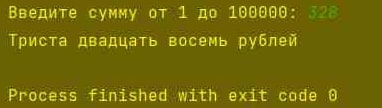
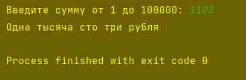
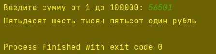
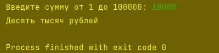

### Исполнитель: Филиппов Кирилл Фт-220007

---

## Банкомат
* Задание: пользователь вводит число от 1 до 100 000 (сумму выдачи в банкомате). Необходимо вывести на экран словами введенную сумму и в конце написать название валюты (рубли) с правильным окончанием.

---

Открыть проект можно в Visual Studio Code или PyCharm 2023.

---
Для запуска программы открыть: /main.py. Вводиться сумма выдачи в банкомате, при верном вводе, сумма выводиться словами.

* main.py - файл для запуска программы

---
* Проверка

### ### [Мой GitHub](https://github.com/ste1wallF)